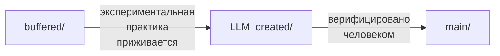

[← README](../README.md) | [↑ SUMMARY](SUMMARY.md)

# Workflows

Потоки работы и как нужно обязательно вести работу.

`workflow_docs` - будет источником стандартов и поведений, без стандарта по
чему-либо процесс нужно приостановить и убедиться, уверен ли пользователь
писать что-то без стандартов работы в этой области. Даже если это разовая
работа, лучше внедрить стандарт, чтобы хотя бы было понятно, почему было
написано так, а не иначе. Так же стандарты являются амортизацией для
увеличения процессов вширь и единообразия структур, а ещё позволяют переносить
знания и полезные практики по инстументам/данным/процессам между проектами,
удешевляя запуск, развертку, анбординг и поддержку.

В `workflow_docs/` будут папки:

> `main/` - основные документы стандартов, которые принимаются или вносятся
> пользователем строго самостоятельно.

> `llm_created/` - документы стандартов, разработанные llm в ходе выполнения
> задач (устоявшиеся).

> `buffered/` - список напрашивающихся стандартов и экспериментальные
> практики, которые после могут перекочевать в `llm_created/` при частом
> использовании, а из `llm_created/` после человеческой валидации и
> согласования произойдет переход в `main/`.

> `links/` - папка, в которой будут архивы по отображению стандартов на файлы,
> которые подвержены конкретным стандартам.

> `auto/` - папка, в которой будут скрипты по обработке/проверке/поиску файлов
> в соответствии с стандартами.

Версионирование стандартов будет в два числа идти `S.J`, и данные правки будут
обозначать следующее:

> S - в стандарт внесены обязательные для исполнения правки, исходя из которых
> нужно пересматривать все файлы, которые связаны с данным стандартом.

> J - в стандарт внесены рекомендательного характера правки, которые являются
> что-то вроде life-quality, и не обязательно править связанные с данным
> стандартом файлы.

У каждого стандарта будет собственно своя шапка с:

* **версией**
* **именем**
* согласованными сокращениями (обязательно уникальными! это будет вроде
  **системы тэгов**, уникальность будет детерминированной машиной проверяться)
* **на какие файлы распространяется** теоретически **стандарт** (например на
  все файлы с расширением `.go`) и может быть ссылка на файл из `auto`, который
  определяет автоматически файлы которые не зарегистрированы под стандарт, хотя
  должны.

В архиве связанных файлов (`links`) будут находиться списки, в которых будут
ссылки на файлы, и версия последнего применяемого к файлу стандарта, и поле для
пометок в каком состоянии находится файл относительно стандарта (устарел, не
применен, валиден, на исправлении, на подтверждении человеком и т.д.).

## Изменение версий

Предложение изменений:

* LLM может предложить новый стандарт или правку через создание файла в
  `buffered/`
* LLM может повысить версию `J` (рекомендательные правки) самостоятельно при
  частом использовании паттерна
* Повышение версии `S` (breaking changes) - только человеком после оценки
  влияния на связанные файлы

Порядок изменения версий стандартов:

